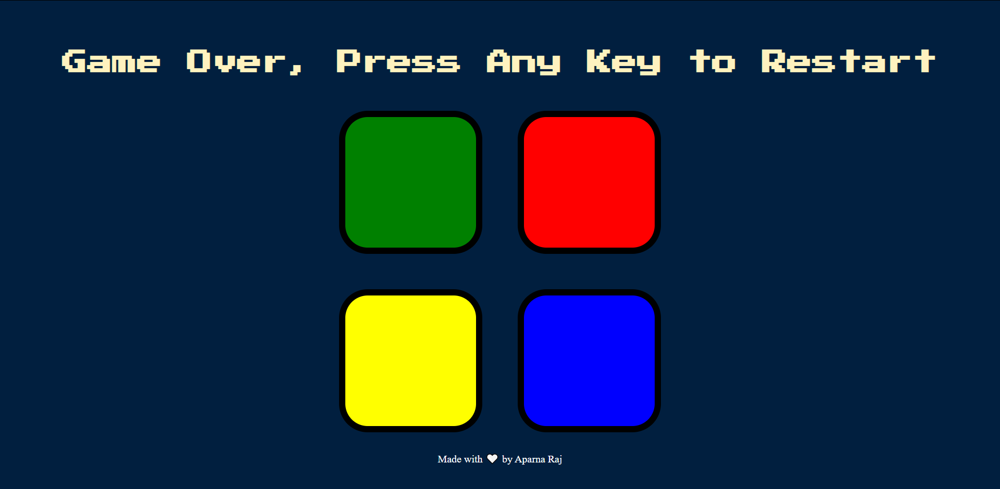

# 🎮 Simon-Game  
The Simon game is the exciting digital game of lights and sounds in which players must repeat random sequences of lights by pressing the colored pads in the correct order. It's fast-paced play, with lights and sounds that can challenge you! Experience the fun as you repeat the patterns and advance to higher levels.

So, are u ready to watch, remember, and repeat?

# Deployment
Deployed Website: https://aparnaraj23.github.io/Simon-Game/

# Built Using
- HTML
- CSS
- Javascript
- jQuery

# Acknowledgments
The Complete 2021 Web Development Bootcamp by Angela Yu.
